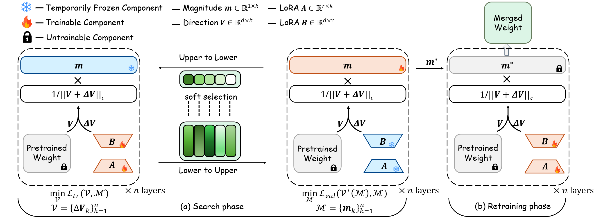
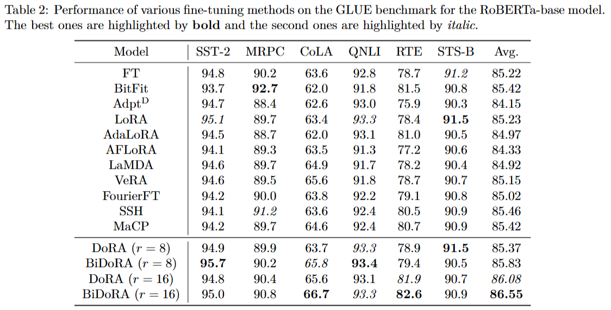
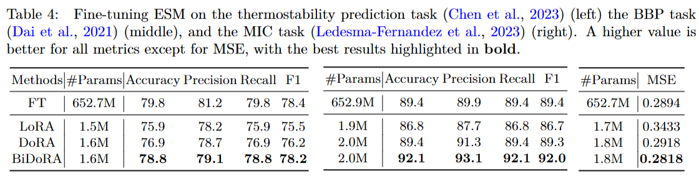

# BiDoRA: Bi-level Optimization-Based Weight-Decomposed Low-Rank Adaptation

This repository contains the official implementation for the paper: **BiDoRA: Bi-level Optimization-Based Weight-Decomposed Low-Rank Adaptation**.


### Methodology

BiDoRA introduces a bi-level optimization (BLO) framework to address the limitations of existing low-rank adaptation methods. Unlike DoRA, which optimizes magnitude and direction components simultaneously, BiDoRA decouples this process into two separate loops.

**DoRA Formulation:**
The update in DoRA is formulated as:

$$
\mathbf{W}^{\prime}=\mathbf{m}\frac{\mathbf{W_0}+\mathbf{B}\mathbf{A}}{\|\mathbf{W_0}+\mathbf{B}\mathbf{A}\|_c}
$$

where $\mathbf{m}$ is the magnitude and $\mathbf{W_0}+\mathbf{B}\mathbf{A}$ represents the direction.

**BiDoRA's Bi-level Optimization:**
BiDoRA reframes this as a BLO problem:

**Lower Level:** Optimizes the direction component ($\mathcal{V}$) on a training data split ($\mathcal{D}_{tr}$) while keeping the magnitude ($\mathcal{M}$) fixed.

$$
\mathcal{V}^*(\mathcal{M})=\arg\min_{\mathcal{V}}\:\mathcal{L}_{tr}(\mathcal{V},\mathcal{M})
$$


**Upper Level:** Optimizes the magnitude component ($\mathcal{M}$) on a separate validation split ($\mathcal{D}_{val}$).

$$
\min_{\mathcal{M}}\:\mathcal{L}_{val}(\mathcal{V}^*(\mathcal{M}),\mathcal{M})
$$

This decoupled optimization allows for a more flexible and robust learning pattern, mitigating overfitting and better aligning with full fine-tuning.

**Framework Overview:**


---

### Key Results

BiDoRA consistently outperforms leading PEFT methods across a wide range of benchmarks.

**GLUE Benchmark Performance:**
BiDoRA shows significant improvements over baselines on the GLUE benchmark.



**Performance on Extremely Small Datasets:**
BiDoRA also demonstrates strong performance on extremely small biomedical datasets, highlighting its effectiveness in mitigating overfitting.



---

### Repository Structure

```
.
├── assets/           # Illustrations and figures for the README
├── examples/         # Scripts and examples to reproduce experiments
│   └── NLU/          # NLU examples (GLUE benchmark)
├── loralib/          # Core library for LoRA, DoRA, and BiDoRA
├── utils/            # Utility scripts
└── README.md
```

### How to Run

To reproduce our results on the GLUE benchmark, please follow these steps:

1.  **Create and activate conda environment:**
    ```bash
    cd examples/NLU
    conda env create -f environment.yml
    conda activate NLU
    ```

2.  **Install loralib:**
    ```bash
    cd ../..
    pip install -e .
    ```

3.  **Install transformers:**
    ```bash
    cd examples/NLU
    pip install -e .
    ```

4.  **Run the scripts:**
    Navigate to the `examples/NLU/scripts` directory and run the desired script. For example:
    ```bash
    cd scripts
    bash roberta_base_cola.sh
    bash roberta_large_mnli.sh
    ```

*(Note: The source code of the transformer library used by BiDoRA is a fork with specific modifications and differs from the main Hugging Face Transformers branch.)*

### Acknowledgements

This work builds upon several outstanding projects from the community:
- [LoRA: Low-Rank Adaptation of Large Language Models](https://github.com/microsoft/LoRA)
- [DoRA: Weight-Decomposed Low-Rank Adaptation](https://github.com/NVlabs/DoRA)
- [Betty: An Automatic Differentiation Library for Multilevel Optimization](https://github.com/leopard-ai/betty)

### License
This repository is under the Apache License 2.0.
